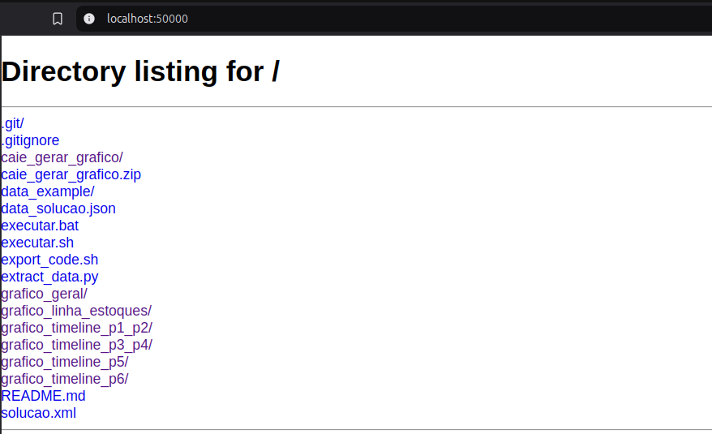
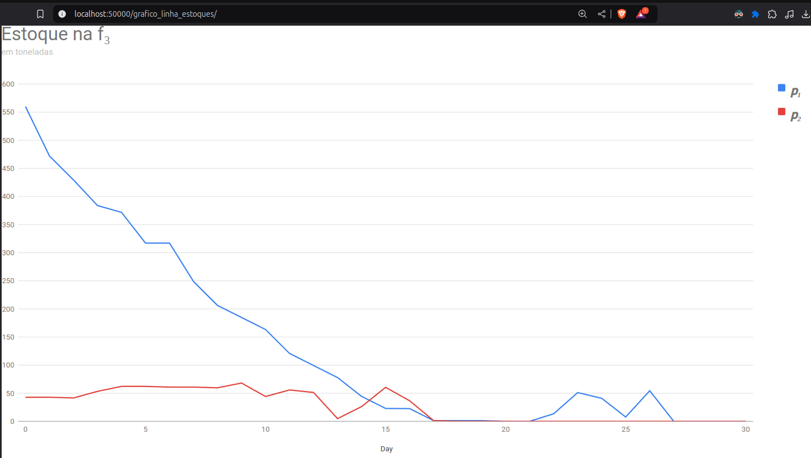
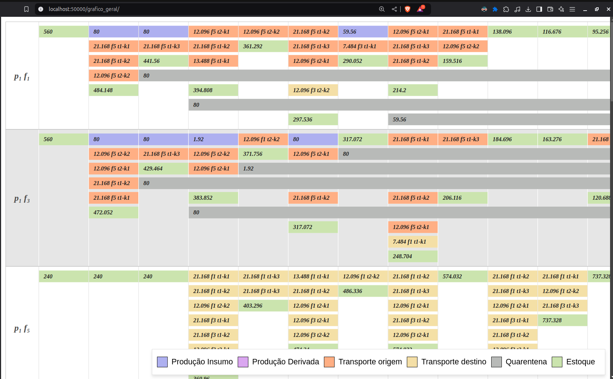

## Gerar Gráficos a partir de uma Solução para Otimizar a Produção

### Introdução

Para executar o projeto, é necessário ter o Python instalado na máquina.

Além disso, o arquivo `solucao.xml` deve ser colocado na raiz do projeto. Esse arquivo será a fonte de todos os dados. Você pode encontrar um exemplo em [solucao.xml](./data_example/solucao.xml)

### Execução

Execute o arquivo [executar.sh](./executar.sh) ou [executar.bat](./executar.bat) no windows.

1. Dê permissão de execução:
   ```sh
   chmod +x executar.sh
   ```
2. Execute:
   ```sh
   ./executar.sh
   ```

Ao executar o script, será gerado o arquivo `data_solucao.json`, contendo todos os dados organizados. Você pode encontrar um exemplo deste arquivo em [data_solucao.json](./data_example/data_solucao.json).
Após a execução, o navegador será aberto automaticamente, exibindo a listagem do diretório com os gráficos.



1. Gráfico de Linha:
   Este gráfico mostra os estoques das fábricas ao longo do tempo.

   

2. Gráfico de Timeline:
   Este gráfico apresenta a sequência e a organização da produção ao longo dos dias.

   
